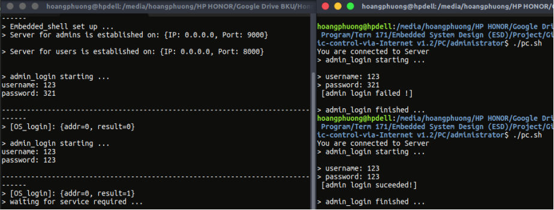
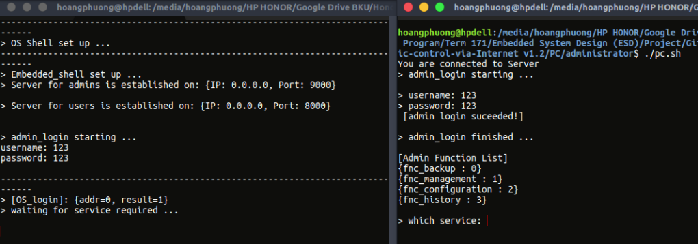

# **Automatic Control via Internet**
This project is implemented for my class assignment of Embedded System Design (ESD). I and my team has developed some versions for other subjects.
### Keywords: `Raspberry Pi, TivaC, Multi thread, Linux, Socket, JSON`
----
## Description
This project simulated a real system that is made up of one sever (cloud database) and clients. Clients have to login by giving their delivered username and password and these info will be sent to server, afterwards clients will recieve the login result. The server has its own administrator having rights to shutdown the server, backup and modify the database and also see the history. Pictures below give you the overview of our system and architecture.

<p align="center">


</p>

## Getting Started
These instructions will get you a copy of the project up and you can develop it for further purposes. See deployment for notes on how to deploy the project on a live system.

### Prerequisites
What things you need to have before operating the whole system
```
Ubuntu 16.04 LTS is the Linux Distro we used in this system.
Raspberry Pi 3/2
TivaC129 or equivalent
PCB board accordant to our design. If you don't have this one, you can operate only one part of our system.
TCP/IP knowledge.
```

### Installing
What you need to install
```
json C library, you can download it from here: http://www.digip.org/jansson/
ssh client on Ubuntu: sudo apt install openssh-client
ssh server on Raspberry Pi 3: sudo apt install openssh-server
```	

## Hierachy of Project
There are four main folder in this project:  **PC**,  **raspberry**,  **tiva**,  **Document**.

**Document** contains such files as *.pdf*, *.docx*, etc describing the whole of our project.
**PC** stores code that executed on a Linux Distro based PC.
**raspberry** stores code that executed on Raspberry Pi.
**tiva** contains code run on Tiva Kit.

## Deployment
At first, you should remotely use ssh on one PC to run the program on server by enter the *raspberry/main* folder and hit ```./rpi.sh```.

After that, you run the program on TivaC129. At this time, you can run program on PC and it can be done simultaneously with TivaC129. Enter PC folder and hit ```./pc.sh```, but you should keep in mind that changing the IP address to raspberry's one in ```pc.sh``` file first.

## Some results
<p align="center">

<p align="center">


</p>

## Authors

* **Le Van Hoang Phuong** - **Leader**, *Operating Platform Development*, *Cloud's Functions Development*
* **Nguyen Chinh Thuy** - *Connecting Architecture*, *Data Transmission*, *Firmware Development*
* **Tran Huy Hoang** - *Version & Market Research* *User Interface Development*
* **Vo Dinh Tri** - *Hardware Design*, *PCB Implementation*

